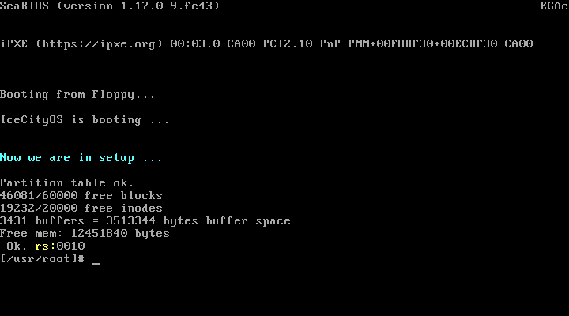
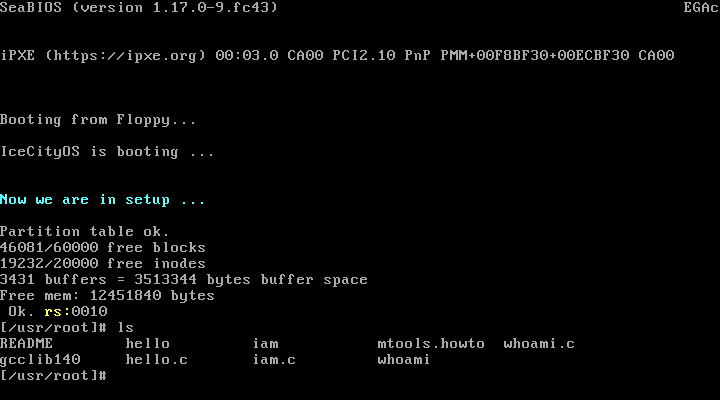
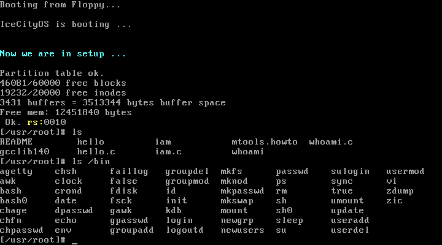

# Linux-v0.11

Linux 内核 **0.11**

中文补注源码移植为 **GCC 方言 + UTF-8**，可直接编译、启动到 shell 并用 gdb 单步调试。

READ THE FUCKING SOURCE CODE.

## 运行效果


| 启动完成 | 执行 `ls` | 执行 `ls /bin` |
|---|---|---|
|  |  |  |


## 快速开始

需要 Linux 环境（本项目在 **Fedora 43** 上验证）。依赖：

```bash
sudo dnf install -y gcc make binutils qemu-system-x86 gdb cscope
```

编译运行：

```bash
./lab.sh build     # 编译 -> Image / tools/system / System.map
./lab.sh run       # QEMU 启动，进入 [/usr/root]# shell
./lab.sh debug     # QEMU 暂停，等 gdb 接入 :1234
./lab.sh shot      # 无图形环境：启动并截屏
./lab.sh cscope    # 生成 cscope 索引
./lab.sh clean     # 清理编译产物
```

也可以直接用 make：

```bash
make               # 顶层 Makefile 递归进入各子目录
qemu-system-i386 -m 16M -boot a -fda Image -hda hdc-0.11.img
```

## 调试

```bash
# 终端 1
./lab.sh debug
```
```bash
# 终端 2
gdb tools/system -ex 'target remote :1234' -ex 'b main' -ex 'c'
```

```gdb
b sys_write      # fs/read_write.c   写文件/终端
b file_write     # fs/file_dev.c
b bread          # fs/buffer.c       读缓冲块
b do_no_page     # mm/memory.c       缺页中断
b do_wp_page     # mm/memory.c       写时复制（fork 后写变量即触发）
b sys_setup      # kernel/blk_drv/hd.c  读取分区表
b sys_fork       # kernel/fork.c
```


## 目录结构

boot/      引导：bootsect.s / setup.s / head.s     （GNU as，AT&T 语法）
init/      内核入口 main.c 与 init()
kernel/    调度、系统调用、中断、字符/块设备驱动
mm/        内存管理：页分配、写时复制、缺页处理
fs/        文件系统：缓冲区、inode、路径解析、执行程序
include/   头文件
lib/       内核库函数
tools/     构建工具与 bochs 配置
docs/      验证截图
hdc-0.11.img   62MB 根文件系统镜像（MINIX 文件系统），启动必需
```

## 注释情况

**87 个 C/H 文件全部带中文注释，约 7.1 万中文字符**，绝大部分保留了赵炯老师的逐行注释。

为保证可运行性，少数文件采用了 GCC 原版实现（保留文件级中文说明，但没有逐行中文注释）：

- `mm/memory.c`
- `fs/buffer.c`、`fs/super.c` 的部分函数
- `kernel/blk_drv/` 下的 `blk.h`、`hd.c`、`floppy.c`、`ll_rw_blk.c`
- `include/unistd.h`、`include/string.h`、`lib/string.c`

汇编文件（`boot/*.s`、`kernel/system_call.s`、`mm/page.s`、`kernel/chr_drv/*`）使用的是
GNU as 版本，注释为英文。


## 编译选项说明

这份 1991 年的代码需要宽松的 C 语义。`Makefile.header` 中的 `CFLAGS`：

| 选项 | 作用 |
|---|---|
| `-std=gnu17` | 恢复 C23 之前的隐式声明 / 空参数列表语义 |
| `-fcommon` | 兼容老式暂定定义（tentative definition） |
| `-fgnu89-inline` | 恢复 GNU89 inline 语义：`inline` 提供外部定义、`extern inline` 不提供。**这份代码原本就假定这个语义**，缺了会出一堆 `undefined reference` |
| `-m32` | 生成 32 位代码 |
| `-fno-builtin` `-fno-stack-protector` `-fomit-frame-pointer` | 内核代码的基本要求 |
| `-Wno-implicit-function-declaration` 等 | 屏蔽旧式写法在现代 GCC 下的告警 |


## 来源与致谢

| 内容 | 来源 |
|---|---|
| 内核源码 | Linus Torvalds, 1991 (`linux-0.11`) |
| 中文逐行注释 | 赵炯《Linux 内核完全注释》V3.0 随书光盘 |
| GCC 可编译移植 | [yuan-xy/Linux-0.11](https://github.com/yuan-xy/Linux-0.11)（falcon/wuzhangjin, 2008） |
| 根文件系统镜像 | oldlinux.org / 同上 |
| 官方归档 | [oldlinux-web/oldlinux-files](https://github.com/oldlinux-web/oldlinux-files) |

在此致谢。赵炯老师的注释是最有价值的部分。


## 关于 `hdc-0.11.img`

62MB 的根文件系统镜像，运行必需。已在仓库中。如果觉得仓库太大，可以改用 Git LFS，或把它排除后从[oldlinux.org](https://github.com/oldlinux-web/oldlinux-files) 单独下载。


## 附注

### 关于 `kernel/who.c`

`kernel/who.c` 实现了两个额外的系统调用 `sys_iam` / `sys_whoami`（调用号 72、73），
**这不是 Linux 0.11 原有代码**，而是 falcon 的移植版为操作系统课程实验附加的功能。
它已注册进系统调用表并参与构建，因此保留。如果你只想要纯净的 0.11，可以删掉
`kernel/who.c`，并从 `kernel/Makefile` 的 `OBJS`、`include/linux/sys.h`、
`include/unistd.h` 中移除对应项。

### 运行不会弄脏镜像

`lab.sh` 启动 QEMU 时带了 `-snapshot` 参数，对 `hdc-0.11.img` 的写入会落到临时文件并在退出时丢弃，因此**每次运行后工作区仍然是干净的**。手工运行 QEMU 时也建议加上：

```bash
qemu-system-i386 -m 16M -boot a -fda Image -hda hdc-0.11.img -snapshot
```

### 关于 `boot/*.s` 的语法

本项目 `boot/` 下的三个汇编文件已被改写成 **GNU as（AT&T 语法）**，因此整套构建只需要binutils，不需要 as86。原始 0.11 的 `boot/*.s` 是 Intel 语法、需要 `as86`/`ld86`
（bin86 包）。对照原始版本时可注意这个差异。

### 行尾

源码一律 LF。`.gitattributes` 已强制 `eol=lf`，避免 Windows 检出时转成 CRLF。